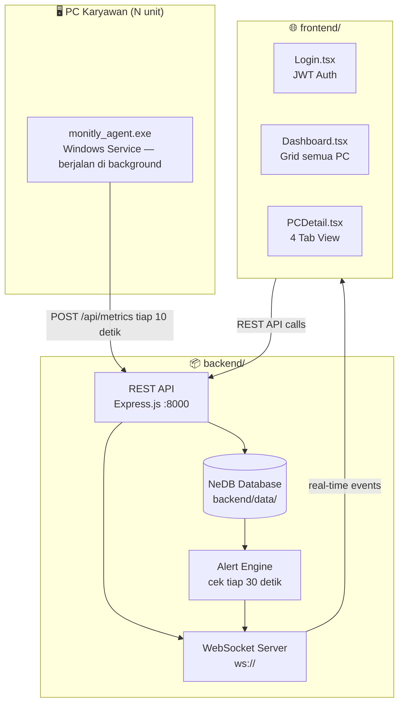
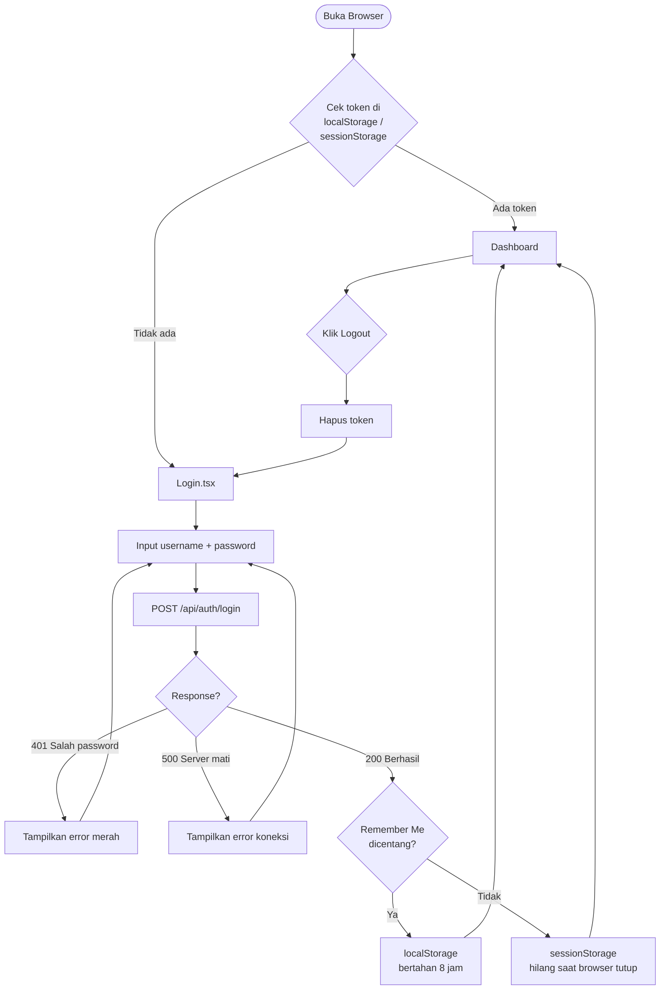
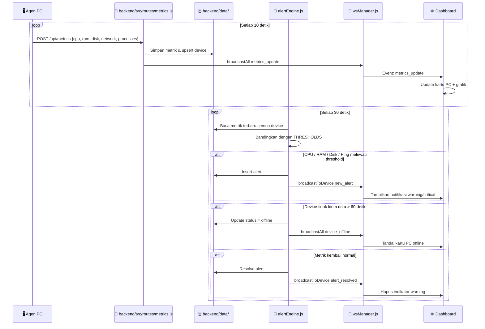
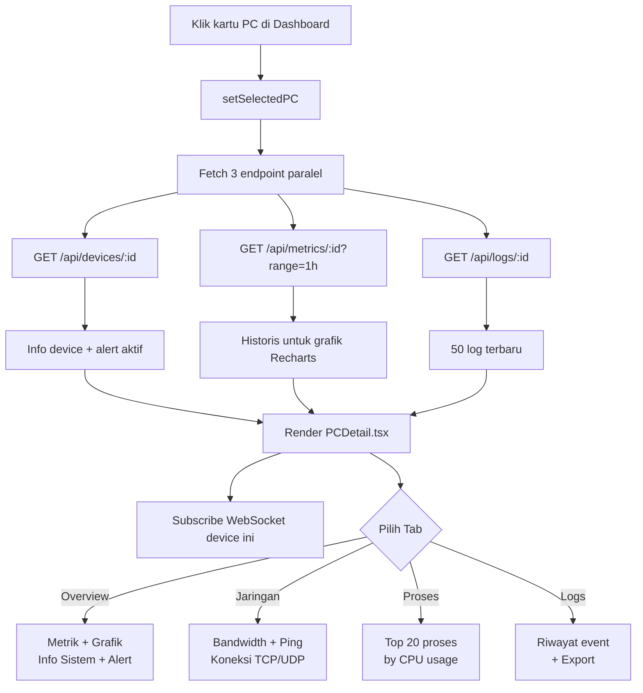
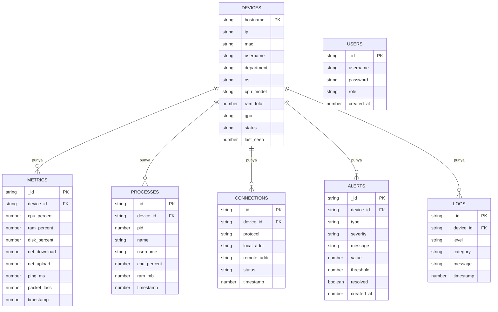
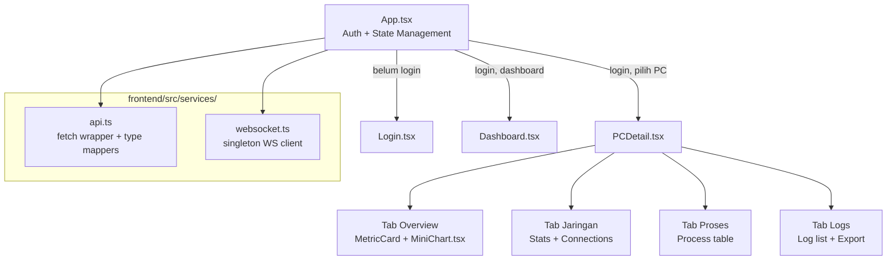
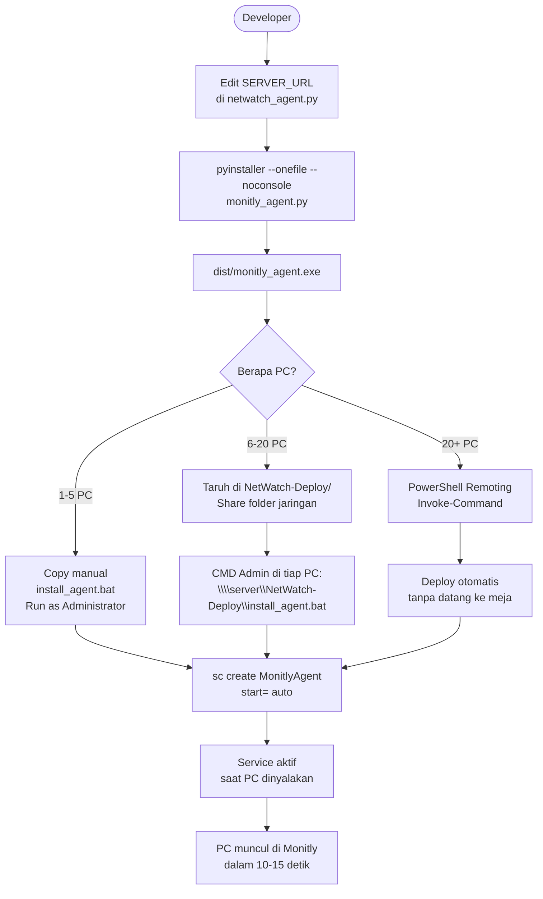

# 📐 Monitly — Arsitektur & Diagram

Diagram teknis sistem Monitly. Semua diagram menggunakan Mermaid dan render otomatis di GitHub.

---

## Arsitektur Sistem

---

## Alur Login & Autentikasi

---

## Alur Data Real-time

---

## Alur Detail PC

---

## Database Collections (NeDB)

---

## Komponen Frontend

---

## Flow Deploy Agen

